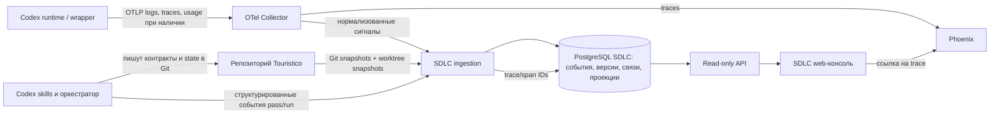

# Архитектура SDLC Observability Plane

Статус: проектное решение для первого релиза · 27 сентября 2026  
Основание: [ТЗ интерфейса](SDLC-observability-plane.md) и действующие skills/артефакты `../Touristico`.

## 1. Решение

Строим **собственную read-only SDLC web-консоль и API** над предметной БД PostgreSQL. Рядом запускаем **Phoenix** для трассировок работы Codex и других LLM-инструментов. OpenTelemetry Collector принимает телеметрию, очищает/маршрутизирует её и передаёт в Phoenix; SDLC ingestion принимает структурированные события от адаптера запуска и индексирует версионированные артефакты Git. Phoenix не становится контроллером цикла или источником статуса фичи.



**Разделение полномочий:** агент и его owning skill изменяют продуктовые и operational артефакты; SDLC ingestion только наблюдает, валидирует, сохраняет историю и вычисляет проекции; web-консоль ничего не записывает в Touristico и не запускает агентов. Запись события в observability plane не считается принятием работы. Принятие фиксируется владельцем исходного артефакта и, где применимо, Git-коммитом.

Phoenix выбран как первоначальный backend трассировок: его self-hosted установка допускает SQLite для локального опыта и PostgreSQL для постоянного развёртывания [Phoenix self-hosting](https://arize.com/docs/phoenix/self-hosting/deploying-phoenix). Langfuse остаётся заменяемым OTLP-получателем: он сильнее в готовой аналитике usage/cost, но его self-hosted стек требует Web, Worker, PostgreSQL, ClickHouse, Redis/Valkey и blob storage [Langfuse self-hosting](https://langfuse.com/self-hosting). Для первой read-only консоли эти зависимости не заменяют предметную SDLC-БД. Прямых записей в внутренние таблицы Phoenix или Langfuse нет.

## 2. Что обнаружено в Touristico

Соглашение: для `docs/features/<feature>/<name>.md` соседние файлы имеют префикс `<name>.*`. В репозитории одновременно встречаются `spec.md` и `refined_feature_spec.md`; обнаружение ведётся по ссылке `Source spec` и относительному расположению, а не по одному имени файла. Примеры — `docs/features/offline_download/refined_feature_spec.*` и `docs/features/location-context/spec.*`.

| Данные | Текущий владелец по skill | Канонический артефакт | Что индексировать |
| --- | --- | --- | --- |
| Поведение фичи | `feature-refiner`, `story-refiner` и авторы source spec | `<name>.md`; story `stories/<id>/spec.md`; ADR при архитектурном решении | Версию текста, хеш и Git anchor; не выводить статус из формулировок |
| Атомарные истины, зависимости | `atomic-decomposer`; `atomic-reviewer` проверяет | `<name>.micro-guarantees.md` | MG ID, активность/supersede, зависимости, source anchor |
| Законы и пути | `law-suite-curator` | `<name>.law-suites.md` | LS/LP ID, связи с MG, оракул, версии |
| Проверочные ячейки и их свидетельства | `law-test-matrix-builder` | `<name>.law-test-matrix.md` | LC ID, LS/LP, status, evidence, причины `SURFACE_STALE`/`SEMANTIC_STALE` |
| Баги по гарантиям | `atomic-updater`, `law-test-matrix-builder`; delivery обновляет ссылку на исправление | `<name>.guarantee-bugs.md` | BG ID, MG links, жизненный цикл, commit/verification |
| Code-first reverse | `reverse-law-auditor` | `<name>.reverse-law-audit.md` | pass ID/mode/fingerprint, IV/RV, outcome, metrics; это текущий документ, история берётся из версий Git и событий |
| Цикл, NF, PG, маршруты, статус, resume | `self-healing-development-orchestrator` | `<name>.development-cycle.state.md` | status/phase/generation, fingerprints, counters, NF/RV routing, escapes, guards, stop reason |
| Обобщённые процессные guards | владелец проектного process guidance | `docs/development/process-guards.md` | PG project ID, происхождение, версия, применимость |
| Единицы доставки и FI/WI | `delivery-orchestrator` | `<name>.delivery-orchestration.md` | FI/WI, BG/LC/MG links, принятые коммиты, blocked/stall |
| Review intake | `review-fix-orchestrator` | `<name>.review-fix-orchestration.md` | RF, решения и маршрут; не сливать RF, FI и NF без явной связи |
| Targeted трассировка закона | `use-case-law-tracer` | опциональный `<name>.use-case-law-trace.md`, плюс обновления matrix/bugs | самостоятельный run только при явном вызове с ID; иначе результат как часть другого pass |
| Атомарная реализация и тесты | `atomic-committer` | Git commit и evidence в matrix/delivery state | commit SHA, work unit, проверенный baseline; коммит сам по себе не делает LC green |

Skills `architecture-review-guard` и `architecture-decision-maker` дают решения/рекомендации; их нельзя трактовать как изменённый контракт до записи owning skill в соответствующий артефакт. `exploratory-tester` даёт свидетельства среды/продукта; владелец LC фиксирует их применимость в матрице. `guarantee-reconstructor`, `behavioral-closure-refiner`, `tdd_writer`, `use-case`, `write-runbook`, `ux-refiner`, `commit-reviewer` могут читать или менять свои документы/код, но не становятся вторыми владельцами MG/LS/LC или controller state. Индексатор обнаруживает такие документы по ссылкам, без догадки о закрытии фичи.

**Практический разрыв:** текущие controller state файлы содержат агрегатные счётчики и текущий snapshot. Например, `offline_download` имеет поколения, NF registry и delivery ledger, но не полную машиночитаемую историю каждого вызова и каждого завершённого pass. Исторические Git версии помогают восстановить изменения артефактов, но не время начала, no-op, попытки и usage, которых не записали. Для этого необходим контракт событий ниже. Старые данные импортируются как `historical_partial`, без выдуманных событий.

## 3. Data contracts и владельцы записи

### 3.1 Уровни истины

1. **Нормативные факты:** source spec, MG, LS/LP, ADR. Меняются только owning skill/автором в Git.
2. **Операционные решения:** controller state, matrix, reverse audit, delivery state, bug backlog, process guards. Меняются только указанными владельцами. Имеют `artifact_version` и проверенный baseline.
3. **Наблюдения:** append-only event envelope, OTel spans/logs, usage, Git snapshot. Их пишет адаптер выполнения/коллектор, без права объявлять MG/LC закрытыми.
4. **Проекции:** `current_feature`, `mg_readiness`, `blockers`, `cost_allocations`, поиск/счётчики. Пишет только SDLC projector в PostgreSQL; пересчитываются из версионированных фактов. В UI всегда видны `as_of`, baseline и полнота.

Одна физическая PostgreSQL-инсталляция допустима, но SDLC и Phoenix используют **разные базы, учётные записи и миграции**. Исходные Git-файлы остаются в Touristico; SDLC-БД хранит их версии/извлечённые записи и ссылки, а не становится новым редактором контрактов.

### 3.2 Обязательные идентификаторы

`repository_id` (стабильный slug), `feature_id` (неизменяемый UUID + человекочитаемый slug), `cycle_id` (UUID), `generation_id` (UUID и номер в cycle), `pass_id` (UUID), `execution_id` (UUID одного запуска агента), `work_unit_id`, `event_id` (UUID), `trace_id`/`span_id` (OTel), `artifact_version_id` (path + commit/tree/blob hash либо worktree snapshot ID). Предметные `MG-001`, `LC-001`, `NF-001` уникальны **только внутри feature/cycle и namespace**; глобальный ключ всегда составной. Отдельные `RF`, `FI`, `RV`, `BG`, `PG`, `IV`, `WI` сохраняют namespace. Связи many-to-many явные и типизированные (`protects`, `binds`, `raised_from`, `routed_to`, `fixed_by`, `verified_by`, `duplicate_of`, `caused_by`).

`baseline_id` указывает на неизменяемый manifest: source/MG/LS/matrix hashes, relevant implementation tree/surface fingerprint, reverse evidence fingerprint, branch и Git SHA при наличии. Git HEAD один не доказывает свежесть. Dirty worktree получает snapshot hash и признак `uncommitted`; после коммита создаётся новый baseline. Generation увеличивается лишь при семантическом изменении нормативного fingerprint, согласно orchestrator skill; рабочий pass или коммит без него generation не увеличивает.

### 3.3 Контракт события `sdlc.event.v1`

Адаптер исполнения отправляет NDJSON в локальный spool и затем в ingestion API. Минимальный envelope:

```json
{
  "schema": "sdlc.event.v1",
  "event_id": "uuid",
  "type": "pass.completed",
  "occurred_at": "2026-09-27T09:00:00Z",
  "observed_at": "2026-09-27T09:00:01Z",
  "repository_id": "touristico",
  "feature_id": "uuid",
  "cycle_id": "uuid",
  "generation_id": "uuid",
  "pass_id": "uuid",
  "execution_id": "uuid",
  "skill": "law-test-matrix-builder",
  "actor_id": "codex-session-or-subagent-id",
  "baseline_id": "sha256:...",
  "scope": {"mg": ["MG-004"], "ls": ["LS-002"], "lc": ["LC-010"]},
  "caused_by": ["event-uuid"],
  "artifact_versions": [{"path": "docs/features/...law-test-matrix.md", "hash": "sha256:..."}],
  "payload": {"mode": "incremental", "outcome": "completed", "verified_lc": ["LC-010"]}
}
```

Обязательны также `producer`, `producer_version`, `idempotency_key`, `source_ref` и `source_confidence` (`direct_event`, `artifact`, `inferred`, `unknown`) на уровне хранимой записи. Входной API проверяет разрешённый namespace, ссылки и схему; неизвестные поля сохраняет в raw JSONB, но не превращает в статус. `occurred_at` задаёт источник, `observed_at` — сервер; причинный порядок задаётся `caused_by`, а не сортировкой по часам. Повтор с тем же `event_id` идемпотентен; конфликт содержимого помещается в quarantine.

Минимальный словарь событий: `cycle.started`, `baseline.captured`, `generation.opened`, `pass.started`, `pass.completed`, `pass.failed`, `pass.noop`, `artifact.published`, `finding.detected`, `finding.decided`, `finding.routed`, `bug.opened`, `bug.closed`, `bug.reopened`, `binding.assessed`, `binding.invalidated`, `work_unit.accepted`, `commit.accepted`, `guard.applied`, `convergence.declared`, `convergence.revoked`, `execution.heartbeat`. События сообщают **что владелец утверждает** и с какой версией файла; ingestion сверяет это с артефактом. Для одного pass результат ровно один terminal (`completed`, `failed`, `noop`); вызов/attempt и завершённый pass считаются отдельно. `noop` требует input fingerprint и ссылку на прошлый эквивалентный pass.

### 3.4 Таблицы и единственный писатель

| Группа данных в SDLC PostgreSQL | Пишет | Обновление |
| --- | --- | --- |
| `repositories`, `features`, `source_artifacts`, `artifact_versions`, `baseline_manifests` | artifact indexer | После Git fetch/commit webhook и локального snapshot; immutable version rows |
| `cycles`, `generations`, `passes`, `executions`, `work_units`, `events`, `event_links` | event ingester | Append-only события, idempotent upsert identity; controller state сверяется с event stream |
| `entities` (MG/LS/LP/LC/NF/RV/BG/PG/RF/FI/WI/IV), `entity_versions`, `entity_links`, `evidence_refs` | artifact parser | Новая версия на изменении source hash; удаления как tombstone/supersede, без стирания истории |
| `telemetry_refs`, `usage_records`, `rate_snapshots`, `allocations` | telemetry normalizer / cost projector | Usage correction версионируется; allocation rule version хранится |
| `feature_projections`, `readiness_projections`, `blocker_projections`, `aggregate_snapshots`, `data_quality` | projector | Пересчёт из фактов, без ручной записи UI |
| Phoenix trace store | Phoenix через OTLP | Только tracing backend; не редактировать его SQL-схему |

Исторический запрос выбирает версии, известные на `as_of`, и baseline того момента. Исправление ошибочной связи добавляет новую версию/компенсирующее событие; прошлый snapshot не переписывается молча. Для параллельных исполнителей `execution_id` и `pass_id` независимы, а принятие commit/work unit возможно лишь при сравнении expected baseline с актуальным controller baseline. Результат на старом baseline показывается как stale и не закрывает текущую MG.

### 3.5 Поля предметных записей и переходы

| Запись | Минимальные поля помимо ID и provenance | Кто утверждает переход |
| --- | --- | --- |
| `Feature/Cycle` | source path, branch, started/ended, controller status/phase, stop reason, safe resume point, current baseline | orchestrator через controller state |
| `Generation` | ordinal, trigger NF/ADR, previous/current normative hashes, affected LS | orchestrator после записи нормативных артефактов |
| `Pass` | skill, mode, scope requested/actually checked, input/output baselines, started/ended, outcome, parent pass, execution | исполняющий skill; orchestrator сверяет счётчики |
| `MG` | statement, source anchor, dependencies, active/superseded, superseded_by | decomposer после reviewer verdict |
| `LS/LP` | law, finite path/state, covered MG, oracle, active/superseded | curator |
| `LC` | LS/LP, MG links, condition, expected outcome, evidence refs, assessed status, stale reasons, assessed baseline | matrix builder |
| `Finding` | namespace и origin, raw anchor, class, duplicate_of, affected MG/LS/LC, decision, route, closure evidence | reverse auditor обнаруживает RV; orchestrator создаёт NF и route; architecture guard решает новое semantic finding |
| `Bug/WorkUnit` | BG/WI ID, linked findings/MG/LC, state, owner, candidate/accepted commits, confirming pass | backlog/delivery owner; LC подтверждает matrix builder |
| `Evidence/Commit` | kind, URI/path/test name, artifact version, checked baseline, result, commit SHA | producing skill/test; applicability утверждает matrix builder |
| `Guard` | PG ID, origin NF, question, target phases, status, recurrence, project promotion | orchestrator для feature-local; process guidance owner для project-level |

Статусы в источниках сохраняются **как есть**, с namespace и версией схемы: например, `DONE` в MG backlog, `BOUND_GREEN` в матрице, `CLOSED` у BG и `CONVERGED` у цикла не являются одной общей шкалой. Проекция MG `confirmed` допускается лишь при активной MG, свежем применимом LC evidence на выбранном baseline и отсутствии блокирующей работы; иные случаи дают `in_progress`, `blocked`, `requires_verification`, `not_started`, `superseded` или `unknown` с объяснением. Канонический status LC принадлежит matrix builder; вычисленная freshness проекция может временно показать `stale` до следующего rebinding, не подменяя содержимое матрицы. Проекция feature readiness проверяет все условия convergence из orchestrator skill и совпадение baseline; историческое `CONVERGED` остаётся в истории даже если текущая readiness отозвана.

## 4. Изменения в агентах Touristico

Детальный план реализации и разделение между скриптами, hooks и prompt/skill приведены в [документе об инструментации](Touristico-agent-instrumentation.md). Для экономии токенов приведённые ниже события в первую очередь создаёт launcher/индексатор из версий артефактов; агент сообщает только семантические решения, которые нельзя восстановить детерминированно. Точные границы внутренних pass требуют явного `phase` или компактной записи в controller ledger; пассивное наблюдение не выдаётся за точную историю.

Skills уже описывают владельцев и файлы. Launcher создаёт технические `cycle_id`, `generation_id`, manifest baseline и `pass_id` там, где он управляет границей прохода; оркестратор сохраняет их в `<name>.development-cycle.state.md` вместе с status/phase/fingerprints и safe resume point. Только оркестратор принимает решение о `CONVERGED` или отзыве сходимости после проверки всех условий своего skill; код публикует это решение как событие с anchor на state file. При рестарте IDs восстанавливаются из state/локального spool, повторная отправка событий безопасна.

Управляемый запуск передаёт специализированному skill только нужный контекст (`feature_id`, `cycle_id`, `generation_id`, `pass_id`, `execution_id`, `baseline_id`, `scope`, `parent_pass_id`). Технические `pass.started`/terminal events и hashes создаёт `sdlc-agent` wrapper; для нескольких внутренних проходов в одном Codex execution границы фиксирует `phase` или controller ledger. При пассивном режиме indexer пишет `pass_observed_partial`, если видит изменённый артефакт, и не выдумывает `pass.started` или no-op. Локальный helper пишет durable spool и асинхронно доставляет его; если helper недоступен, canonical Markdown всё равно сохраняется, а покрытие телеметрии помечается неполным.

| Skill/группа | Конкретная добавка к контракту pass |
| --- | --- |
| decomposer/reviewer/curator | входные и выходные нормативные hashes; изменённые/superseded MG, LS/LP; reviewer verdict и generation trigger |
| matrix builder | LC IDs в scope, реально проверенные LC, per-LC result/evidence, stale reason и проверенный implementation fingerprint |
| reverse auditor | `full`/`incremental`/`noop`, IV/RV IDs, class/yield, `input_fingerprint`, финальный outcome; отдельное событие на каждую новую RV |
| architecture guard | входная находка, decision ID/outcome, rationale anchor, target owner; `finding.decided` без автоматического изменения MG |
| delivery/atomic committer/commit reviewer | WI/BG/LC scope, candidate base SHA, accepted commit SHA, тестовые evidence, post-commit matrix requirement, discarded/replaced candidate отдельно от accepted commit |
| use-case-law-tracer | явный run/pass ID, target MG/LS/LC, mode, реально трассированные LC/LP, verdict; опциональная trace note с anchor |
| exploratory tester и другие вспомогательные | evidence reference, environment/result; LC status меняет только matrix builder |

Для raw review findings сохранять исходный ID/URL/commit anchor; intake присваивает NF только после дедупликации. RV→NF→decision→BG/LC→commit→verification требует **явных ссылок**, иначе консоль показывает разрыв. Упоминание ID в свободном тексте разрешено как кандидат связи с `source_confidence=inferred`, но не как доказанное ребро закрытия.

## 5. Сбор телеметрии и экономика

В официальной конфигурации Codex есть раздельные `otel.exporter` для logs, `otel.trace_exporter` для traces и `otel.metrics_exporter`; настройки `otel` в проектном `.codex/config.toml` игнорируются, поэтому конфигурировать нужно пользовательский/управляемый Codex config или launch environment [OpenAI Docs: Configuration Reference](https://developers.openai.com/codex/config-reference). Collector получает эти сигналы, фильтрует секреты/текст запросов (по умолчанию `otel.log_user_prompt=false`), ставит service/environment и передаёт traces в Phoenix. OTel logs Codex не считаются автоматически Phoenix spans: отдельный normalizer переводит только проверенные типы событий в SDLC observations. Связь с pass делается через контекст wrapper/launcher и явные trace IDs, когда они доступны; ненадёжное сопоставление по времени остаётся `unattributed`.

**Уровни покрытия usage:**

1. `call_exact` — прямой response/billing call ID, модель и per-call usage; предпочтительный уровень для экономики.
2. `turn_reported` — Codex turn/session usage, привязанный к execution/pass; полезен для суммарных токенов, но не равен множеству доказанных LLM-вызовов.
3. `trace_partial` — часть spans имеет usage.
4. `unknown` — нет надёжной записи. Отсутствие usage никогда не равно нулю.

Если агенты запускаются через `codex exec`, wrapper сохраняет его структурированный event stream/exit status и связывает с pass; конкретные поля проверяются на используемой версии Codex до реализации parser. Интерактивная Codex-сессия без wrapper/специальных hooks может дать только частичную атрибуцию. Нельзя создавать фиктивные LLM call rows из количества tool calls или из агрегата turn. Для OpenAI Agents API официальные docs прямо называют usage best-effort, допускают `null` и поздние исправления; это ориентир для модели полноты, не утверждение о биллинге локального Codex [OpenAI Docs: Observability and usage](https://developers.openai.com/api/docs/guides/agents-api/observability).

`usage_records` хранит raw provider fields, нормализованные **непересекающиеся** категории input, cached input, output, reasoning (reasoning может входить в output и не прибавляется вторично), модель, единицу, валюту, источник и timestamp исправления. Тариф закрепляется в `rate_snapshots` на момент расчёта; неизвестная цена даёт known lower bound и неоценённую долю. При работе через подписку/пакетный тариф без per-call цены показывать токены и `currency_cost=unknown`, не выдумывать API-цену. Требование непересекающихся buckets соответствует [Langfuse token/cost guidance](https://langfuse.com/docs/observability/features/token-and-cost-tracking).

Одна исходная usage запись входит в feature total один раз. `allocations` распределяет её в прямые MG, shared MG scope (равные веса по умолчанию) и overhead; суммы долей равны 1 для каждой оценённой записи. У одного BG может быть несколько MG, но bug count и cost source уникальны. Версия scope/rule сохраняется. Прогноз расходов строится только при достаточном покрытии и истории; иначе UI показывает `нет надёжного прогноза`. Phoenix/Langfuse cost UI является вторичной аналитикой; финансовая проекция консоли использует собственные raw usage + rate snapshots.

## 6. Ingestion, API и UI

**Ingestion pipeline:**

1. Git indexer обнаруживает feature source и соседние артефакты, записывает immutable snapshots с commit SHA или worktree snapshot ID. Для удалённых репозиториев — webhook + периодический reconcile; для локальных незакоммиченных файлов — watcher с debounce и content hash. Доступ к исходникам только read-only.
2. Parser с версиями грамматики извлекает заголовки/таблицы/ссылки и сохраняет raw anchor (path, revision, heading/row, line). Неизвестный формат даёт parse warning и сохраняет raw snapshot. Никакого `green` из слова `DONE` в MG backlog.
3. Event ingester принимает `sdlc.event.v1`, дедуплицирует, сверяет ссылки с snapshots и помечает pending до появления версии файла. Spool доставляется с retry/backoff; потеря связи с сервером не теряет локально подтверждённое событие.
4. Projector строит current/historical views, freshness и blockers. При изменении source/MG/LS/matrix/implementation fingerprint инвалидирует зависимые LC и convergence для **отображения**, но не меняет controller file. При расхождении с controller показывает `source conflict` и оба значения; не подменяет решение оркестратора.
5. Reconciler регулярно сравнивает event counters с controller state и Git snapshots; пропуски отмечает `partial`, обновляет latency и quarantine. Telemetry backfill исправляет usage только новой версией.

Read-only HTTP API: `/features`, `/features/{id}`, `/guarantees`, `/guarantees/{id}`, `/verification`, `/findings`, `/passes`, `/cycles`, `/economics`, `/investigate`, `/entities/{kind}/{id}/history`, `/data-quality`. Все списки поддерживают cursor pagination, фильтры и `as_of`/`baseline_id`; ответ содержит `source_refs`, `observed_at`, `coverage`, `warnings`, `projection_version`. `GET /.../cost` возвращает original usage IDs и allocation rule ID. Авторизация: viewer для UI, отдельные tokens/credentials для event ingest, Git reader и Phoenix; секреты не попадают в браузер. Ссылки на Phoenix ведут по trace ID и доступны только авторизованному viewer.

Web-консоль реализует [карту экранов ТЗ](SDLC-observability-plane.md): портфель, фичу, MG, LC/проверки, циклы/проходы, находки, экономику и расследование. Счётчики открывают состав; URL сохраняет фильтры и baseline. `CONVERGED` показывается как решение контроллера **на конкретном baseline** и только с отдельной текущей freshness оценкой. Для отдельных секций допустим независимый error/partial state.

## 7. Развёртывание первого релиза

Минимальный состав Docker Compose для локального/командного развёртывания:

| Сервис | Назначение | Постоянное состояние |
| --- | --- | --- |
| `postgres` | две базы `sdlc` и `phoenix`, разные роли | volume + backup |
| `phoenix` | traces UI и OTLP receiver | своя база PostgreSQL |
| `otel-collector` | OTLP ingress, filtering, routing, retry | bounded queue; при нужной гарантии — persistent queue |
| `sdlc-api` | read-only API, auth, Phoenix link resolver | нет |
| `sdlc-ingester` | Git/artifact parser, event + telemetry normalizer, reconciler/projector | SDLC PostgreSQL; локальный durable spool у producer |
| `sdlc-web` | SPA/SSR консоль | нет |

За reverse proxy с TLS; внутренние OTLP/ingest endpoints не открывать наружу без auth. Для постоянного использования нужны миграции БД, резервные копии обеих БД, retention raw telemetry, health checks и метрики ingest lag, parse errors, unmatched events, unknown usage. Phoenix auth требуется включить явно: по умолчанию в self-hosted deployment она выключена [Phoenix authentication](https://arize.com/docs/phoenix/deployment/authentication). В dev допустимо начать с одной машины; production-HA и выбранный frontend framework — отдельное инфраструктурное решение, не меняющее data contracts.

## 8. Порядок реализации и проверка

1. Зафиксировать `sdlc.event.v1`, manifest baseline и ID propagation в orchestrator; сделать `sdlc-agent` launcher/reconciler с локальным spool. Пилотировать на `location-context` (незавершённый цикл) и `offline_download` (богатая история), не переписывая старые артефакты.
2. Реализовать Git snapshot/parser для source, MG, LS/LP, matrix, bugs, reverse audit, controller state, delivery state и project guards. Импорт исторических версий маркировать `historical_partial`.
3. Поднять PostgreSQL, Phoenix, Collector и ingester; подключить Codex OTel конфиг вне проектной `.codex`, проверить корреляцию 1 pass → execution → trace и режим без trace.
4. Реализовать read-only API и экраны обзора, MG, LC, прохода, finding и расследования; затем economics с coverage и аллокацией. Не показывать точную стоимость до проверки уровня `call_exact` и тарифа.
5. Прогнать сквозные сценарии из ТЗ: stale после семантического изменения, две параллельные попытки, RV→NF→BG/LC→commit→verification, no-op отдельно от executed pass, один BG на несколько MG, потеря/позднее появление usage, отсутствующие данные и historical as-of.

**Критерий архитектурной готовности:** на любой цифре/статусе API возвращает состав и первичные anchors; у каждой записи есть владелец записи, baseline, версия и provenance; отсутствие события или usage отражается как неполнота, а не как успешный ноль. Это условие важнее выбора между Phoenix и Langfuse.
